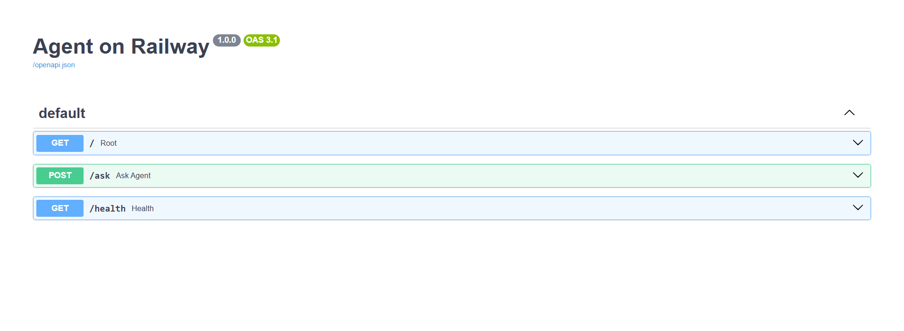
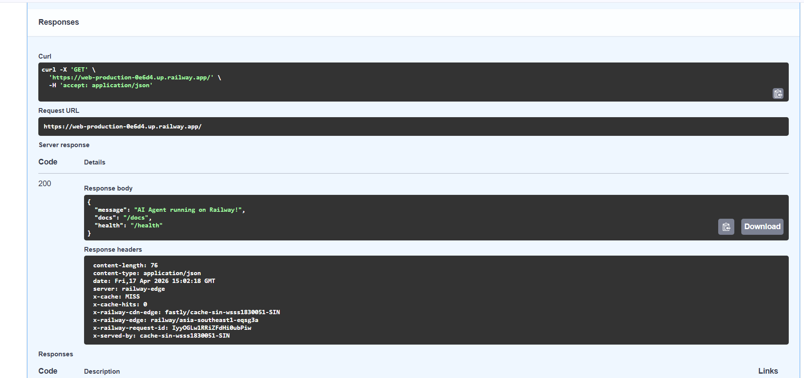
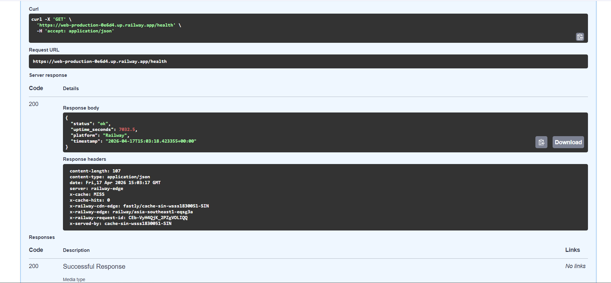

# Day 12 Lab - Mission Answers

## Part 1: Localhost vs Production

### Exercise 1.1: Anti-patterns found
1. API key is hardcoded in source code.
2. Database URL with password is hardcoded.
3. Debug mode is enabled directly in code.
4. Configuration does not come from environment variables.
5. Secret key is printed in logs.
6. No `/health` endpoint.
7. No `/ready` endpoint.
8. App binds only to `localhost`, not `0.0.0.0`.
9. Port is fixed to `8000`.
10. Reload mode is enabled like a development server.
11. No graceful shutdown handling.

### Exercise 1.3: Comparison table
| Feature | Develop | Production | Why Important? |
|---------|---------|------------|----------------|
| Config | Hardcoded in code | Loaded from environment variables through config | Easier to change between local, staging, and production |
| Secrets | Hardcoded | Not stored directly in business logic | Prevents leaking credentials to GitHub |
| Input handling | Query parameter | JSON request body | More standard for APIs |
| Health check | Not available | `/health` exists | Platform can detect whether the service is alive |
| Readiness check | Not available | `/ready` exists | Load balancer can know when the app is ready |
| Logging | `print()` | Structured logging | Easier to debug and monitor |
| Host binding | `localhost` | `0.0.0.0` | Required for Docker and cloud deployment |
| Port | Fixed `8000` | Configurable via env | Works with Railway/Render injected ports |
| Shutdown | Abrupt | Graceful lifecycle and SIGTERM handling | Helps avoid dropping requests during shutdown |

### Test results
Production version successfully returned:
- `GET /` -> app metadata
- `GET /health` -> status ok
- `GET /ready` -> ready true
- `POST /ask` with JSON body -> successful mock response

## Part 2: Docker

### Exercise 2.1: Dockerfile questions
1. Base image:
   `02-docker/develop/Dockerfile` uses `python:3.11`.
   `02-docker/production/Dockerfile` uses `python:3.11-slim` for both `builder` and `runtime`.
2. Working directory:
   `/app`
3. Why copy `requirements.txt` first?
   Docker can cache the dependency installation layer. If application code changes but dependencies do not, Docker reuses the cached `pip install` layer and rebuilds faster.
4. CMD vs ENTRYPOINT:
   `CMD` provides the default command and can be replaced easily at runtime.
   `ENTRYPOINT` defines the main executable of the container and is usually harder to override.
   In this lab, `CMD` is appropriate because we want a simple default start command such as `python app.py` or `uvicorn ...`.

### Exercise 2.2: Build and run
- Basic image built from `02-docker/develop/Dockerfile`.
- Observed local image size: `agent-develop` = `1.66GB`.
- The container is configured to expose port `8000` and start with `CMD ["python", "app.py"]`.

### Exercise 2.3: Multi-stage build
- Stage 1 (`builder`) installs build dependencies and Python packages.
- Stage 2 (`runtime`) copies only the installed packages and the application source needed at runtime.
- The final image is smaller because it does not keep build tools such as `gcc`, package build layers, or unnecessary intermediate files.

### Exercise 2.3: Image size comparison
- Develop image: `1.66GB`
- Production image: `236MB`
- Difference: `1.424GB` smaller
- Reduction: about `85.8%`

This meets the lab target of keeping the production image below `500MB`.

### Exercise 2.4: Docker Compose stack

Architecture:

```text
Client
  |
  v
Nginx (port 80/443)
  |
  v
Agent (FastAPI)
  | \
  |  \
  v   v
Redis  Qdrant
```

## Part 3: Cloud Deployment

### Exercise 3.1: Railway deployment
- URL: https://web-production-0e6d4.up.railway.app/docs
- Screenshot:
- 
- 

## Part 4: API Security

### Exercise 4.1-4.3: Test results

#### Exercise 4.1: API Key authentication
Đã kiểm thử thành công API Key authentication trong thư mục `04-api-gateway/develop`.

Kết quả:
- `POST /ask` không gửi `X-API-Key` trả về `401 Unauthorized`
- `POST /ask` với key sai trả về `403 Forbidden`
- `POST /ask` với key đúng trả về `200 OK`

Nhận xét:
- API key được đọc từ biến môi trường `AGENT_API_KEY`
- Việc kiểm tra key được thực hiện trong hàm `verify_api_key()`
- Nếu thiếu key thì hệ thống từ chối truy cập
- Nếu key sai thì hệ thống báo key không hợp lệ
- Có thể rotate key bằng cách đổi biến môi trường và khởi động lại service

#### Exercise 4.2: JWT authentication
Đã kiểm thử JWT authentication trong thư mục `04-api-gateway/production`.

Kết quả:
- `GET /health` của service production trả về `200 OK`
- Gọi `POST /auth/token` với tài khoản `student / demo123` nhận được `access_token`
- Dùng header `Authorization: Bearer <token>` để gọi `POST /ask` thành công và nhận được phản hồi `200 OK`
- Endpoint `POST /ask` trả về đầy đủ `question`, `answer` và `usage`

Ví dụ response khi gọi `/ask` bằng JWT:

```json
{
  "question": "Explain JWT",
  "answer": "Đây là câu trả lời từ AI agent (mock). Trong production, đây sẽ là response từ OpenAI/Anthropic.",
  "usage": {
    "requests_remaining": 9,
    "budget_remaining_usd": 2.1e-05
  }
}
```

Nhận xét:
- JWT chứa thông tin `username`, `role`, thời điểm tạo token và thời gian hết hạn
- Server xác thực token trước khi cho phép truy cập endpoint được bảo vệ
- Endpoint lấy token là `/auth/token`
- User demo trong bài lab là `student / demo123`, còn admin demo là `teacher / teach456`

#### Exercise 4.3: Rate limiting
Đã kiểm thử rate limiting bằng cách gửi liên tiếp nhiều request tới `POST /ask` với cùng token của user `student`.

Kết quả:
- Các request đầu được xử lý bình thường
- Khi vượt ngưỡng, server trả về `429 Too Many Requests`
- Trong lần kiểm thử thực tế, các request số `10`, `11` và `12` trong vòng lặp đã nhận `429`

Nhận xét:
- Thuật toán được sử dụng là `Sliding Window Counter`
- User thường có giới hạn `10 request/phút`
- Admin có giới hạn `100 request/phút`
- Hệ thống chọn limiter theo role, nên admin được quota cao hơn

### Exercise 4.4: Cost guard implementation
Phần cost guard đã được cài đặt trong `04-api-gateway/production/cost_guard.py` để kiểm soát chi phí gọi LLM và tránh vượt ngân sách.

Cách hoạt động:
- Mỗi user có một ngân sách riêng là `$1/ngày`
- Toàn bộ hệ thống có một ngân sách chung là `$10/ngày`
- Trước khi gọi LLM, hàm `check_budget(user_id)` sẽ kiểm tra cả ngân sách của user và ngân sách toàn hệ thống
- Nếu user đã vượt ngân sách trong ngày, API trả về `402 Payment Required`
- Nếu toàn hệ thống đã vượt ngân sách chung, API trả về `503 Service Unavailable`
- Sau khi có phản hồi từ agent, hệ thống tính chi phí dựa trên số token input và output rồi cộng dồn vào usage

Nhận xét triển khai:
- Chi phí được ước tính theo công thức giá trên mỗi `1000` token input và output
- Usage được lưu theo từng user, bao gồm số request, số input token, số output token và tổng chi phí trong ngày
- Hệ thống có endpoint `/me/usage` để người dùng xem thống kê usage của chính mình
- Phiên bản lab hiện tại lưu dữ liệu bằng in-memory nên phù hợp cho demo và học tập
- Trong production thực tế, nên chuyển phần lưu usage sang Redis hoặc database để không mất dữ liệu khi restart và để hỗ trợ scale nhiều instance

## Part 5: Scaling & Reliability

### Exercise 5.1-5.5: Implementation notes

#### Exercise 5.1: Health check và readiness check
Đã kiểm tra thành công hai endpoint trong phần `05-scaling-reliability/develop` và `05-scaling-reliability/production`.

Kết quả:
- `GET /health` trả về `200 OK`
- `GET /ready` trả về `200 OK`
- Ở môi trường production chạy qua Nginx load balancer, `curl http://localhost:8080/health` trả về:
  - `status: "ok"`
  - `storage: "redis"`
  - `redis_connected: true`
- `curl http://localhost:8080/ready` trả về:
  - `ready: true`
  - `instance: <instance-id>`

Nhận xét:
- `/health` dùng như liveness probe để xác nhận process còn sống
- `/ready` dùng như readiness probe để xác nhận instance đã sẵn sàng nhận traffic
- Trong production, readiness còn kiểm tra được kết nối Redis

#### Exercise 5.2: Graceful shutdown
Phần graceful shutdown đã được cài đặt trong `05-scaling-reliability/develop/app.py`.

Cách triển khai:
- Ứng dụng đăng ký signal handler cho `SIGTERM` và `SIGINT`
- Khi shutdown, biến `_is_ready` được chuyển sang `False` để ngừng nhận request mới
- Hệ thống chờ các request đang xử lý hoàn tất bằng bộ đếm `_in_flight_requests`
- `uvicorn` được cấu hình `timeout_graceful_shutdown=30`

Nhận xét:
- Cơ chế này giúp container không bị tắt đột ngột khi đang xử lý request
- Đây là mẫu triển khai phù hợp cho môi trường deploy thật, nơi orchestrator thường gửi `SIGTERM` trước khi dừng container

#### Exercise 5.3: Stateless design
Phần stateless design đã được triển khai trong `05-scaling-reliability/production/app.py`.

Cách làm:
- Session và conversation history không lưu trong memory của từng instance
- Tất cả state được lưu trong Redis thông qua `save_session()` và `load_session()`
- Endpoint `/chat` nhận `session_id`; nếu request tiếp theo đi vào instance khác thì vẫn đọc được history từ Redis
- Endpoint `/chat/{session_id}/history` trả về toàn bộ hội thoại của session

Nhận xét:
- Thiết kế này giải quyết đúng vấn đề khi scale ngang nhiều instance
- Bất kỳ instance nào cũng có thể phục vụ request tiếp theo của cùng một user
- Trong bản đã chỉnh, production mặc định yêu cầu Redis để tránh rơi về in-memory ngoài ý muốn

#### Exercise 5.4: Load balancing
Đã chạy thành công stack load balancing bằng Docker Compose:

```bash
docker compose up -d --build --scale agent=3
docker compose ps
```

Kết quả:
- 3 agent instances cùng chạy: `production-agent-1`, `production-agent-2`, `production-agent-3`
- Redis chạy healthy
- Nginx chạy và expose cổng `8080`
- `docker compose logs agent` cho thấy cả 3 instance đều khởi động thành công và kết nối Redis

Nhận xét:
- Nginx đóng vai trò load balancer ở phía trước
- Các request được phân phối qua nhiều instance khác nhau
- Hệ thống vẫn hoạt động ổn định khi scale lên 3 agent

#### Exercise 5.5: Test stateless design
Đã chạy script:

```bash
python test_stateless.py
```

Kết quả:
- Tạo thành công một `session_id`
- Gửi 5 request liên tiếp trong cùng session
- Các request được phục vụ bởi 3 instance khác nhau:
  - `instance-f5896c`
  - `instance-b92a88`
  - `instance-79e4ed`
- Conversation history vẫn được giữ nguyên với `10` messages sau toàn bộ 5 lượt hỏi đáp
- Script kết luận:
  - `All requests served despite different instances`
  - `Session history preserved across all instances via Redis`

Kết luận:
- Thiết kế stateless hoạt động đúng khi scale nhiều instance
- Session không phụ thuộc vào memory của một instance cụ thể
- Redis đóng vai trò shared state cho toàn bộ cụm agent